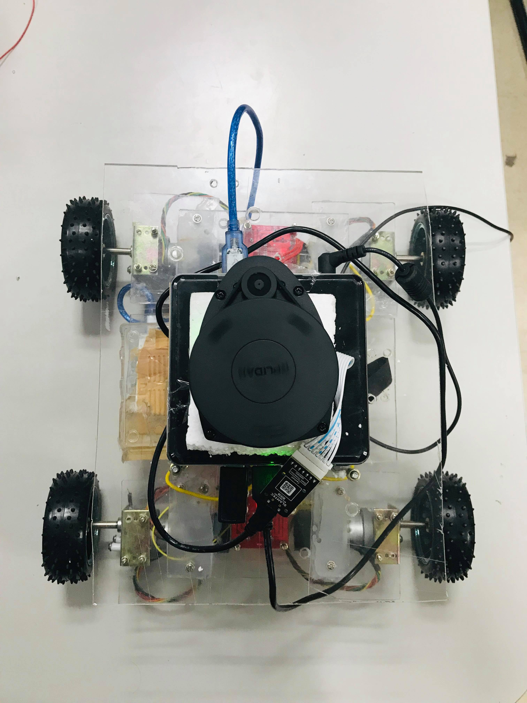

<!-- Start Writing Below in Markdown -->

## Autonomous Robot for Library Enhancement(ARLE)

A project aimed at library maintenance by keeping the books sorted and in proper location. This will be achieved by an autonomous robot which can pick and place books from various locations in the library and keep it in the correct shelf.

__________________________________

